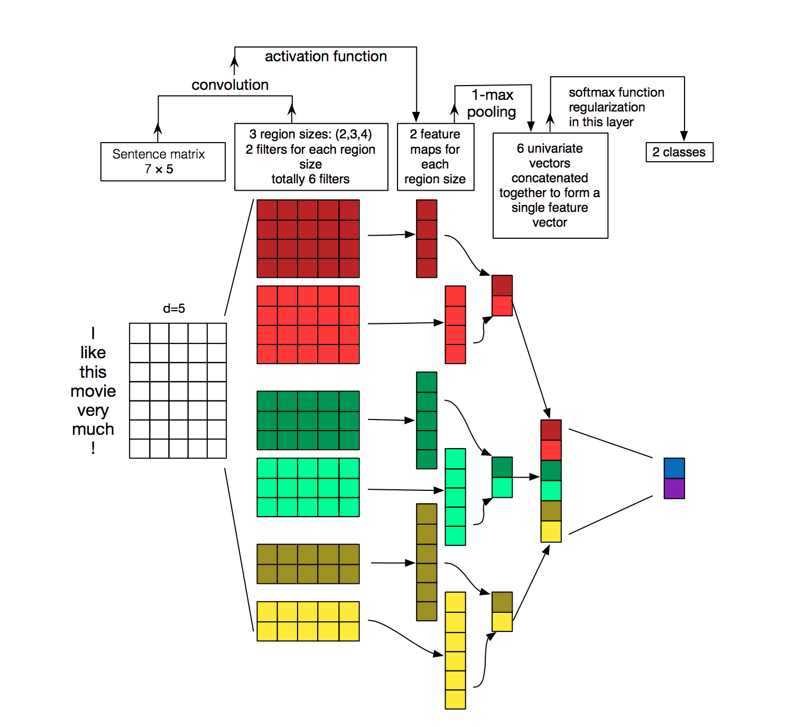

http://colah.github.io/posts/2014-07-Conv-Nets-Modular/
http://www.wildml.com/2015/11/understanding-convolutional-neural-networks-for-nlp/
http://colah.github.io/posts/2014-07-Understanding-Convolutions/

### Understanding-Convolutions
http://colah.github.io/posts/2014-07-Understanding-Convolutions/

https://www.khanacademy.org/math/differential-equations/laplace-transform/convolution-integral/v/introduction-to-the-convolution
不知道在講殺小

紅色 filter 的 region size 是 4, 所以一次會取 4 個 row, 所以會有
(1,2,3,4), (2,3,4,5), (3,4,5,6), (4,5,6,7) 一共四個值
因為一個 region size 要 2 個 filter , 所以會有兩組紅色的, 其他 region size 以此類推

接下來 你就有了多個 1 * n 的 vector, 然後使用 1-max pooling, 你會得到 3 個 vector

最後把這三個 vector 加總起來,

Illustration of a Convolutional Neural Network (CNN) architecture for sentence classification. Here we depict three filter region sizes: 2, 3 and 4, each of which has 2 filters. Every filter performs convolution on the sentence matrix and generates (variable-length) feature maps. Then 1-max pooling is performed over each map, i.e., the largest number from each feature map is recorded. Thus a univariate feature vector is generated from all six maps, and these 6 features are concatenated to form a feature vector for the penultimate layer. The final softmax layer then receives this feature vector as input and uses it to classify the sentence; here we assume binary classification and hence depict two possible output states. Source: Zhang, Y., & Wallace, B. (2015). A Sensitivity Analysis of (and Practitioners’ Guide to) Convolutional Neural Networks for Sentence Classification.

## about word vector
https://www.tensorflow.org/tutorials/word2vec

為什麼需要 word vector, NLP 以往常用 word 視為是彼此獨立的符號, 所以可能用 id143 代表 `cat`, id678 代表 `dog` 。 這麼做的壞處是,我們浪費了很多珍貴的資訊, 沒有辦法讓系統學習到 `cat` 與 `dog` 之間的關係 (i.e. 都是動物, 有四隻腳...), 使用 vector 來表示一個單字, 可以解決這類型的問題。

## RNN
http://colah.github.io/posts/2015-08-Understanding-LSTMs/
https://www.tensorflow.org/tutorials/

## setup jupyter notebook and keras in ec2
https://blog.keras.io/running-jupyter-notebooks-on-gpu-on-aws-a-starter-guide.html
