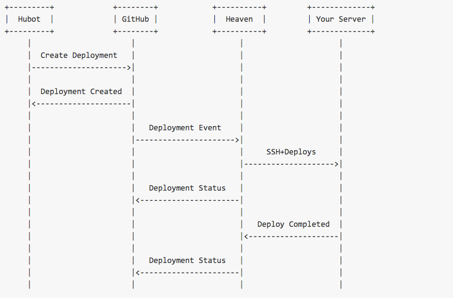

#ChatOps
使用[heaven](https://github.com/atmos/heaven)與[hubot-deploy](https://github.com/atmos/hubot-deploy)進行聊天室部署(ChatOps)

##Overview


###部署流程

1. 透過Hubot使用[Deployment API](https://developer.github.com/v3/repos/deployments/)告訴GitHub你要部署的repo與設定(i.e. 環境,哪個branch...)
2. GitHub將這個event丟給heaven
3. heaven根據GitHub的event選擇對應的Provider(i.e. heroku)然後開始部署
4. Provider會將部署的消息透過指定的Notifier(i.e. Slack)回傳

##heaven設定
1. 設定`config/secrets.yml`
2. 設定環境變數`GITHUB_TOKEN`
3. 設定你的Notifier環境變數，如果你是使用Slack就是要設定`SLACK_WEBHOOK_URL`
4. 如果你的github repo有安裝ci，然後你不想要auto deploy，記得在heavne的webhook disable `status` event

###capistrano
把要部署的rails project裡會用到的cap gem全部加到`heaven`的`Gemfile`
例如下面這樣:

```ruby
gem 'capistrano-rails'
# integrate bundler with capistrano
gem 'capistrano-bundler'
# if you are using RBENV
gem 'capistrano-rbenv'
gem "capistrano-resque", "~> 0.2.2", require: false
gem 'whenever', :require => false
```

###使用local進行precompile assets時的設定
####把要部署的rails project裡與assets相關的gem全部加到`heaven`的`Gemfile`

####如果有使用webpack記得要在cap task裡面先執行`webpack`

###設定resque
如果你的heaven不是部署在heroku的話，記得把`capistrano-resque`加到`Gemfile`。
```ruby
gem "capistrano-resque", "~> 0.2.2", require: false
```

##hubot-deploy設定
要在`apps.json`設定每一個要部署的app
```js
{
  "deploy411": {
  "provider": "heroku",
  "auto_merge": false,
  "repository": "ocowchun/hello_world",
  "environments": ["production"],
  "heroku_production_name": "hello_world-9527"
  }
}
```

###常用hubot-deploy指令

###see what environments you can deploy app
`hubot where can I deploy <app>`

####檢視`node`,`hubot`,`hubot-deploy`的版本號
`hubot deploy:version`

####部署指定的app與branch到production
`hubot deploy <app>/<branch>`

####部署指定的app與branch到指定的環境
`hubot deploy <app>/<branch> in <env> `
(i.e.部署`hello_world`的`staging`branch到`staging`stage)

##add github ssh key to heaven
1. add ssh key to github
2. add below code to `.profile`
```bash
eval "$(ssh-agent -s)"
ssh-add ~/.ssh/id_rsa
echo "hello ocowchun"
```

##forward-agent設定
https://developer.github.com/guides/using-ssh-agent-forwarding/#setting-up-ssh-agent-forwarding
tbd
https://developer.github.com/guides/using-ssh-agent-forwarding/

##deploy-status
https://github.com/flowdock/hubot-deploy-status

##reference
[heaven-overview](https://github.com/atmos/heaven/blob/master/doc/overview.md)
