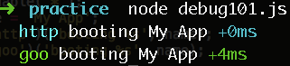

#[debug](https://github.com/visionmedia/debug)

##install
```sh
$ npm install debug
```

##usage

```js
var debug = require('debug');
debug.enable("*");
var name = 'My App';
debug('http')('booting %s', name);
debug('goo')('booting %s', name);
```


